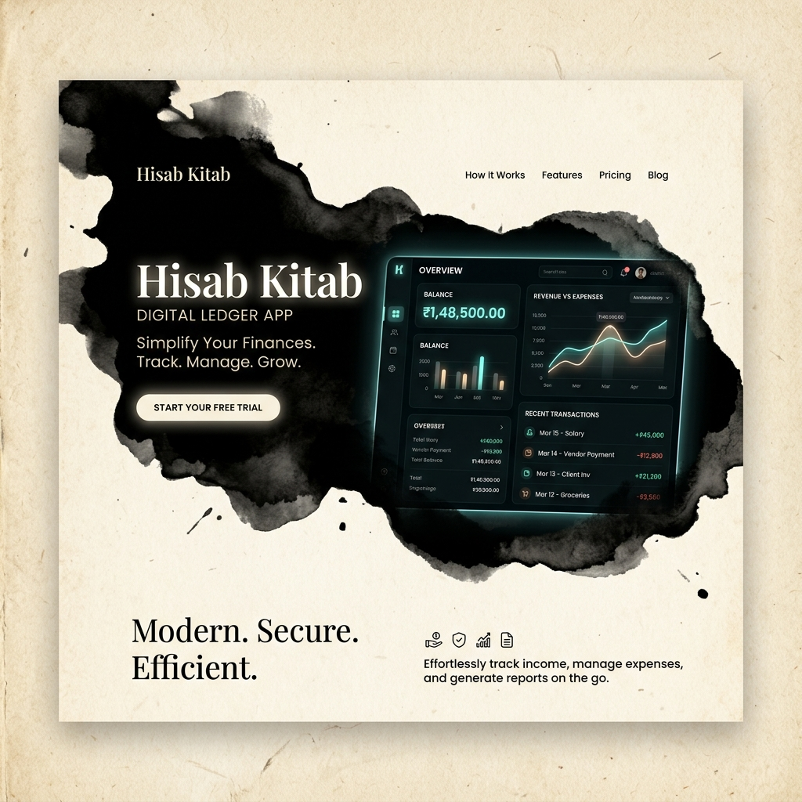
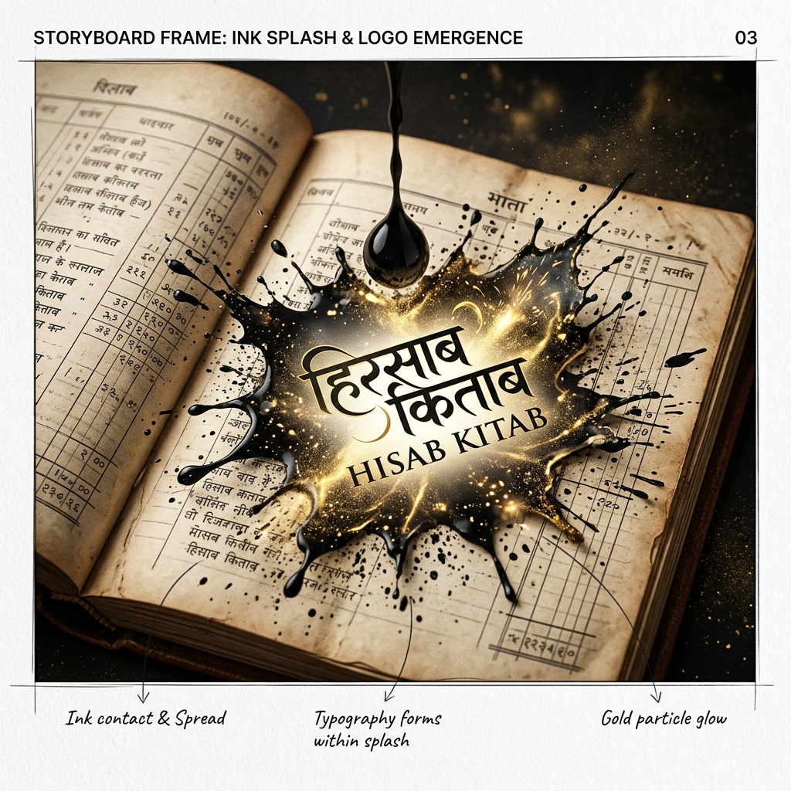
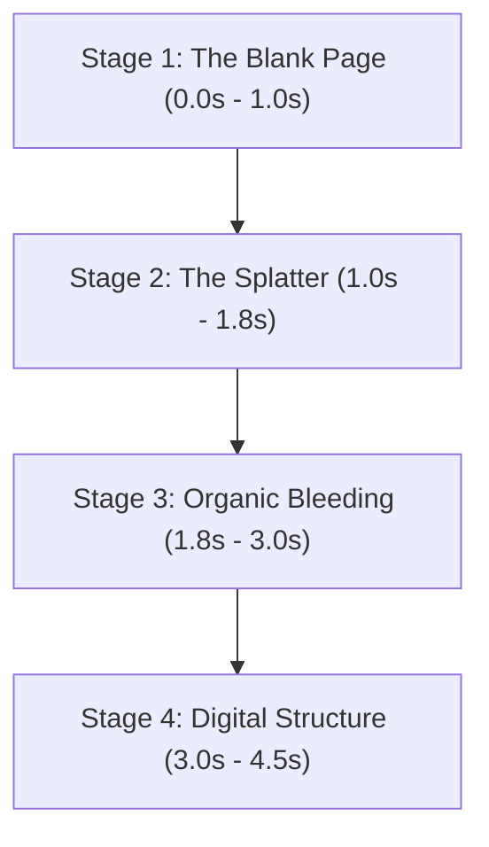

# 🖊️ Hisab Kitab Landing Page — Ink Spill Animation Design

This document details the visual concepts, storyboard sequence, and technical implementation plan for the landing page ink spill animation of **Hisab Kitab**. 

The core theme revolves around **"Paper to Pixel"** — representing the transition from messy, manual, handwritten paper ledgers (traditional bahi-khata) to clean, structured, and audit-safe digital bookkeeping.

---

## 🎨 Visual Identity & Palette

To make the landing page feel premium, warm, and authentic, the animation transitions between two primary palettes:

| Palette | Primary Color | Secondary Color | Accent Color | Vibe |
|---|---|---|---|---|
| **Traditional Paper (Start)** | Warm Cream (`#F9F6EE`) | Charcoal/Pencil (`#2C2A29`) | Terracotta/Red Ink (`#C84B31`) | Tactile, organic, traditional register book |
| **Digital Ledger (End)** | Deep Midnight Black (`#0B0F19`) | Steel Grey (`#E2E8F0`) | Emerald Green (`#10B981`) & Gold (`#D4AF37`) | Professional, secure, real-time |

---

## 🎬 Animation Storyboard: Concept 1 — "The Transition Mask" (Recommended)

In this concept, the ink spill serves as a transition mask. The user lands on a traditional paper screen, and an organic ink spill reveals the digital dashboard underneath.

````carousel

<!-- slide -->

````

### Step-by-Step Breakdown



### 1. Stage 1: The Blank Page (0.0s - 1.0s)
* **Visuals**: A clean, warm cream-colored textured paper background. In the center, a faint, hand-drawn pencil line grid sits quietly. 
* **Micro-interactions**: The cursor moves with a tiny ink-dripping tail or pen nib shadow, encouraging the user to click or scroll.

### 2. Stage 2: The Splatter (1.0s - 1.8s)
* **Visuals**: An virtual ink droplet falls from the top. When it hits the center, it splashes outwards, creating a highly realistic, organic black-blue blot with tiny satellite droplets.
* **Feel**: The splash happens quickly with high physical impact (using custom cubic-bezier easing to feel snappy).

### 3. Stage 3: Organic Bleeding & Expansion (1.8s - 3.0s)
* **Visuals**: The edges of the ink blot begin to bleed and creep outwards, as if absorbing into paper fibers.
* **The Magic**: Inside the dark ink spill, a modern dark-themed digital UI (Hisab Kitab app interface) is revealed. The ink blot serves as a mask; as it spreads to fill the screen, it "washes" the traditional paper away, converting it into a sleek digital workspace.

### 4. Stage 4: Digital Structure & Grid Reveal (3.0s - 4.5s)
* **Visuals**: Once the ink fills 80% of the screen, the organic fluid edges smoothly snap/morph into clean, straight grid lines, charts, and transaction cards. The dark blue-black of the ink becomes the dark background of the dashboard, and golden accents glow to highlight active ledger balances.

---

## 💫 Alternative Concepts

### Concept 2: "Calligraphic Logo Sprout"
Rather than transitioning the whole screen, a small ink drop spills on paper, and the blot morphs specifically into the brand wordmark **Hisab Kitab** (written in a sleek hybrid of Hindi/Sanskrit calligraphic strokes and modern English characters). The surrounding ink droplets stretch out to form linear graphs and ledger tables underneath the logo.

### Concept 3: "Scroll-Driven Ink Seeping"
* As the user scrolls down the landing page, ink doesn't just splash; it seeps down the page in fine capillaries (like water traveling through paper).
* Each section of the landing page (Features, Audit Trail, AI Scan) is connected by these seeping ink lines. When the ink reach a feature block, it lights up/triggers the feature illustration.

---

## 🛠️ Technical Design & Feasibility (Non-Code Specs)

To achieve this animation without lag or heavy video assets, we propose three lightweight front-end approaches:

### 1. SVG Displacement Mapping (Highly Performance-Efficient)
Using standard HTML elements layered behind an SVG `<filter>` with `<feTurbulence>` and `<feDisplacementMap>`.
* **How it works**: By animating the `baseFrequency` or `scale` attributes of the SVG turbulence, we can make any simple circular mask warp and look like liquid spreading organically on paper fibers.
* **Pro**: Extremely small file size (a few lines of markup), works on any UI layout underneath.

### 2. Canvas Particle System
Using an HTML5 `<canvas>` element overlay.
* **How it works**: A simulation of hundreds of dark particles shooting outward from the impact point, leaving trails that blend together using a "metaball" shader or canvas blur filter.
* **Pro**: Highly interactive; the splash can react dynamically to where the user clicks.

### 3. CSS Masking with SVG Morphing
Using CSS `mask-image` linked to an inline SVG path.
* **How it works**: Using library options like GSAP (GreenSock) to morph a small ink drop SVG path into a full-screen rectangular path.
* **Pro**: Excellent browser compatibility, smooth transitions.
